# 🚗 Vehicle Insurance End-to-End ML Project


<!-- Add code coverage badge if available -->

---

## 📑 Table of Contents
- [Quick Start](#-quick-start)
- [Overview](#overview)
- [Features](#features)
- [Project Structure](#project-structure)
- [End-to-End Workflow](#end-to-end-workflow)
- [Cloud & DevOps](#cloud--devops)
- [Local Development](#local-development)
- [Deployment on AWS EC2](#deployment-on-aws-ec2)
- [CI/CD Pipeline](#cicd-pipeline)
- [Usage](#usage)
- [Example Inputs/Outputs](#example-inputsoutputs)
- [Tech Stack](#tech-stack)
- [Configuration](#configuration)
- [Environment Variables](#environment-variables)
- [Running Tests](#running-tests)
- [Documentation](#documentation)
- [FAQ](#faq)
- [Contributing](#contributing)
- [Changelog](#changelog)
- [Contact](#contact)
- [Security & Privacy](#security--privacy)
- [License](#license)

---

## ⚡ Quick Start

```bash
git clone https://github.com/yourusername/Proj-Vehicle_insurance-end_to_end.git
cd Proj-Vehicle_insurance-end_to_end
pip install -r requirements.txt
python app.py
```

---

## 📖 Overview
A robust, production-ready machine learning pipeline for predicting vehicle insurance outcomes. This project covers the full ML lifecycle: data ingestion, validation, transformation, model training, evaluation, deployment, and serving predictions via a modern web interface. The solution is cloud-native, leveraging AWS S3 for model storage, EC2 for deployment, and CI/CD for automation.

---

## 🚀 Features
- Automated Data Ingestion, Validation, and Transformation
- Model Training, Evaluation, and Selection
- Seamless Model Storage and Retrieval from AWS S3
- User-Friendly Web App for Real-Time Predictions
- CI/CD Pipeline for Continuous Integration and Deployment
- Production Deployment on AWS EC2
- Comprehensive Logging and Error Handling

---

## 🗂️ Project Structure

```mermaid
graph TD;
  A[Proj-Vehicle_insurance-end_to_end/]
  A --> app_py[app.py]
  A --> demo_py[demo.py]
  A --> Dockerfile
  A --> requirements_txt[requirements.txt]
  A --> setup_py[setup.py]
  A --> config_dir[config/]
  config_dir --> model_yaml[model.yaml]
  config_dir --> schema_yaml[schema.yaml]
  A --> notebook_dir[notebook/]
  notebook_dir --> dataset_vehicle_csv[dataset_vehicle.csv]
  notebook_dir --> exp_notebook_ipynb[exp-notebook.ipynb]
  notebook_dir --> rf_model_pkl[rf_model.pkl]
  A --> src_dir[src/]
  src_dir --> cloud_storage_dir[cloud_storage/]
  cloud_storage_dir --> aws_storage_py[aws_storage.py]
  src_dir --> components_dir[components/]
  components_dir --> data_ingestion_py[data_ingestion.py]
  components_dir --> data_validation_py[data_validation.py]
  components_dir --> data_transformation_py[data_transformation.py]
  components_dir --> model_trainer_py[model_trainer.py]
  components_dir --> model_evaluation_py[model_evaluation.py]
  components_dir --> model_pusher_py[model_pusher.py]
  src_dir --> configuration_dir[configuration/]
  configuration_dir --> aws_connection_py[aws_connection.py]
  configuration_dir --> mongo_db_connection_py[mongo_db_connection.py]
  src_dir --> constants_dir[constants/]
  src_dir --> data_access_dir[data_access/]
  data_access_dir --> proj1_data_py[proj1_data.py]
  src_dir --> entity_dir[entity/]
  entity_dir --> artifact_entity_py[artifact_entity.py]
  entity_dir --> config_entity_py[config_entity.py]
  entity_dir --> estimator_py[estimator.py]
  entity_dir --> s3_estimator_py[s3_estimator.py]
  src_dir --> exception_dir[exception/]
  src_dir --> logger_dir[logger/]
  src_dir --> pipeline_dir[pipeline/]
  pipeline_dir --> prediction_pipeline_py[prediction_pipeline.py]
  pipeline_dir --> training_pipeline_py[training_pipeline.py]
  src_dir --> utils_dir[utils/]
  utils_dir --> main_utils_py[main_utils.py]
  A --> static_dir[static/]
  static_dir --> css_dir[css/]
  css_dir --> style_css[style.css]
  A --> templates_dir[templates/]
  templates_dir --> vehicledata_html[vehicledata.html]
  A --> logs_dir[logs/]
  A --> README_md[README.md]
```

<details>
<summary><strong>Click to expand: Project Structure (Mermaid Diagram)</strong></summary>


</details>

---

## ⚙️ End-to-End Workflow
1. **Data Ingestion:** Raw vehicle data is ingested and validated.
2. **Data Transformation:** Data is cleaned, encoded, and prepared for modeling.
3. **Model Training & Evaluation:** ML models are trained, evaluated, and the best model is selected.
4. **Model Pushing:** The production model is uploaded to AWS S3.
5. **Web App Deployment:** The app is deployed on AWS EC2, serving predictions via a user-friendly interface.
6. **CI/CD Automation:** GitHub Actions (or your chosen CI/CD tool) automates testing, building, and deployment to EC2.

---

## ☁️ Cloud & DevOps
- **AWS S3:** Stores the trained model (`model.pkl`) for production use.
- **AWS EC2:** Hosts the web application for public access.
- **CI/CD:** Automates deployment after every push to the main branch.

---

## 🖥️ Local Development
1. **Clone the repository:**
   ```bash
   git clone https://github.com/yourusername/Proj-Vehicle_insurance-end_to_end.git
   cd Proj-Vehicle_insurance-end_to_end
   ```
2. **Install dependencies:**
   ```bash
   pip install -r requirements.txt
   ```
3. **Run the app:**
   ```bash
   python app.py
   ```
   The app will be available at [http://localhost:5000](http://localhost:5000).

---

## 🌐 Deployment on AWS EC2
1. **Launch an EC2 instance** (Ubuntu recommended, t2.micro for testing; larger for production).
2. **Open required ports** (e.g., 5000, 80) in the Security Group.
3. **SSH into your instance** and clone the repo.
4. **Install Python and dependencies.**
5. **Set up AWS credentials** for S3 access (see [Configuration](#configuration)).
6. **Run the app:**
   ```bash
   python app.py --host 0.0.0.0 --port 5000
   ```
7. **Access the app** via your EC2 public IP:  
   `http://<your-ec2-public-ip>:5000`

---

## 🔄 CI/CD Pipeline
- **Automated Build & Test:** Every push triggers the pipeline to build, test, and deploy the latest code to EC2.
- **Zero-downtime Deployment:** The app is restarted automatically after deployment.
- **Easy Rollback:** Previous versions can be redeployed if needed.

---

## 📝 Usage
- Visit the web app.
- Enter vehicle data in the form.
- Click "Predict" to get insurance predictions instantly.

---

## 🧾 Example Inputs/Outputs

**Example Input:**
| Feature         | Value         |
|-----------------|--------------|
| Age             | 35           |
| Vehicle Type    | Sedan        |
| Annual Premium  | 12000        |
| ...             | ...          |

**Example Output:**
| Prediction      | Probability   |
|-----------------|--------------|
| Will Buy        | 0.87         |
| Will Not Buy    | 0.13         |

---

## 🛠️ Tech Stack
- **Python 3.10**
- **FastAPI**
- **scikit-learn**
- **AWS S3, EC2**
- **GitHub Actions** (or your CI/CD tool)
- **Docker** (optional)

---

## ⚙️ Configuration
- **AWS Credentials:**  
  Set up your AWS credentials for S3 access:
  ```bash
  export AWS_ACCESS_KEY_ID=your_access_key
  export AWS_SECRET_ACCESS_KEY=your_secret_key
  export AWS_DEFAULT_REGION=your_region
  ```
- **Model & Schema Config:**  
  Edit `config/model.yaml` and `config/schema.yaml` as needed.

---

## 🧾 Environment Variables
| Variable                 | Description                  | Example                |
|--------------------------|------------------------------|------------------------|
| AWS_ACCESS_KEY_ID        | AWS access key               | AKIA...                |
| AWS_SECRET_ACCESS_KEY    | AWS secret key               | wJalrXUtnFEMI...       |
| AWS_DEFAULT_REGION       | AWS region                   | us-east-1              |
| ...                      | ...                          | ...                    |

---

## 🧪 Running Tests
To run the unit tests:
```bash
pytest tests/
```

---

## 📚 Documentation
- [Project Wiki](https://github.com/AnandVadgama/Proj-Vehicle_insurance-end_to_end) <!-- Add if available -->

---

## 🔒 Security & Privacy
- User data is not stored after prediction.
- AWS credentials should be kept secure and never committed to source control.
- For production, use environment variables and secrets management.

---

## 📄 License
This project is licensed under the [MIT License](LICENSE).
